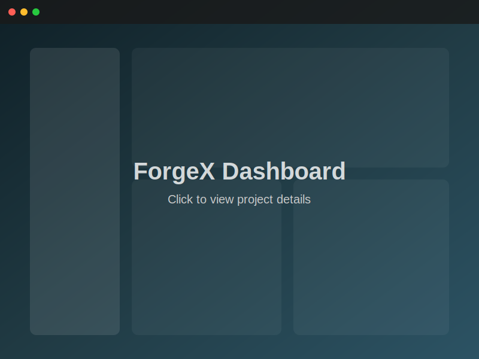
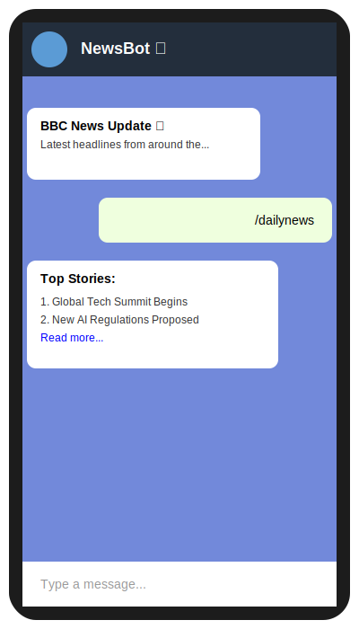

  <h1>Hi there, I'm Raj 👋</h1>
  
<b>Full Stack Developer | Automation Enthusiast | Java & Python Specialist</b>

  
  
  
  
    

  
  
  

---

### 🚀 About Me

I build practical tools, bots, and web apps using **Python**, **Java**, **TypeScript**, and **SQL**. I enjoy automation, scraping, and creating small full‑stack projects that solve real-world problems.

- **Current Focus:** Building scalable web applications and exploring advanced automation.
- **Languages:** Python, Java, TypeScript, JavaScript, SQL, HTML/CSS
- **Interests:** Web Development, scraping bots, and system architecture.

  <h3>🛠️ Tech Stack</h3>
  
  
  
  
  

---

### 📂 Featured Projects

| Project                       | Description                                                 | Tech & metrics                                                                                                                                                                                                              |
| :---------------------------- | :---------------------------------------------------------- | :-------------------------------------------------------------------------------------------------------------------------------------------------------------------------------------------------------------------------- |
| **ForgeX**                    | A frontend-focused TypeScript project with a sleek design.  |             |
| **Library Management System** | A robust Java-based system for managing library operations. |            |
| **Telegram News Bot**         | Automates news fetching from BBC & The Hindu via RSS feeds. |     |

---

### 📸 Visuals & Demos

> _Working on adding new screenshots here!_

Click to view Project Screenshots

|                               ForgeX                               |                            Library System                            |                         Telegram Bot                         |
| :----------------------------------------------------------------: | :------------------------------------------------------------------: | :----------------------------------------------------------: |
|  |  |  |

---

  
📫 <b>Get in Touch</b>

  

    <a href="mailto:raj310994@gmail.com">raj310994@gmail.com</a>
  

